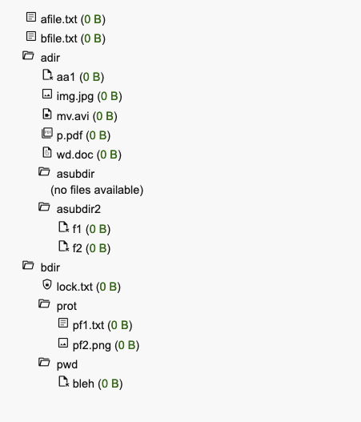

## html and javascript to generate a clickable file system hierarchy underneath a specified directory

the directory is watched; modifications are reflected in the output 

as a package: start `filesystemhtml.WatchFS()` and then query `filesystemhtml.FSResponse` as needed

`FSResponse[0]` is html

`FSResponse[1]` is js to display that html

```
% tree
.
├── adir
│   ├── aa1
│   ├── asubdir
│   └── asubdir2
│       ├── f1
│       └── f2
├── afile.txt
├── bdir
└── bfile.txt

```




